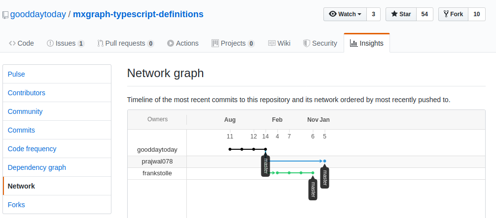
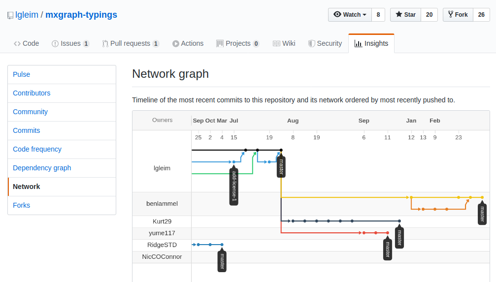

# mxGraph TypeScript existing solutions

**Note**: only document NPM package when available i.e. no NPM information means that there is no published NPM package

## Type definitions

###  [aleics/mxgraph-types](https://github.com/aleics/mxgraph-types)

> This repo served as base for the [DefinitelyTyped PR #34695](https://github.com/DefinitelyTyped/DefinitelyTyped/pull/34695),
> which is closed. See also [aleics/mxgraph-types #1](https://github.com/aleics/mxgraph-types/issues/1)

Analysis done on `2020-04-11`  
1st commit: `2018-08-24`  
Latest commit: `2019-01-16`, [6a7bfb3](https://github.com/aleics/mxgraph-types/commit/6a7bfb3f6a8ac33d4c83ddbee2c2f8e946834b12)  
License: `none`  
Overview
- mxGraph support: `3.9.8` (see the `version` file)
- one definition file per mxGraph file
- all files stored in the repository root
- all types declared in the `mxgraph namespace`

### [asual/mxgraph-factory](https://github.com/asual/mxgraph-factory)

Analysis done on `2020-04-11`  
1st commit: `2018-12-10`  
Latest commit: `2020-04-08`, [40714ba](https://github.com/asual/mxgraph-factory/commit/40714bad98906c3ae3d0e02ff2d312e88ec73177)  
Latest NPM package: [4.1.1](https://www.npmjs.com/package/mxgraph-factory) on `2020-04-08`   
License: `Apache-2.0`  
Overview
- mxGraph support: `4.1.1`
- non only provide type definitions: `A tiny wrapper around mxgraph that provides a configurable TypeScript compatible package.`
- type definitions based on https://github.com/lgleim/mxgraph-typings, see `src/mxgraph-typings.d.ts` and [issue #2](https://github.com/asual/mxgraph-factory/issues/2#issuecomment-522977770)
- accept contributions, latest merged on [2020-02-28](https://github.com/asual/mxgraph-factory/pull/7) 

### [gooddaytoday/mxgraph-typescript-definitions](https://github.com/gooddaytoday/mxgraph-typescript-definitions)

> This was the 1st repository on GitHub that provided types definitions  
> `gooddaytoday` opened the issue on `DefinitelyTyped` to request `mxGraph` support, see [#5317](https://github.com>/DefinitelyTyped/DefinitelyTyped/issues/5317)

Analysis done on `2020-03-18`  
1st commit: `2015-08-06`  
Latest commit: `2015-08-14`, [990a148](https://github.com/gooddaytoday/mxgraph-typescript-definitions/commit/990a148a2dd2a603c3137957b39663d5a1d772c7)  
License: `none`  
Overview
- disclaimer `Now definitions are poor. A lot of <any> types and empty classes.`
- one definition file per mxGraph source subfolder
- [not maintained](https://github.com/gooddaytoday/mxgraph-typescript-definitions/issues/1#issuecomment-225819484)

#### Forked repositories

[gooddaytoday/network](https://github.com/gooddaytoday/mxgraph-typescript-definitions/network) on `2020-04-02`

Forks containing additional types
- https://github.com/frankstolle/mxgraph-typescript-definitions (latest commit on 2017-11-06): based on `prateek14` fork
- https://github.com/prajwal078/mxgraph-typescript-definitions (latest commit on 2018-01-05)
- https://github.com/prateek14/mxgraph-typescript-definitions (latest commit on 2017-02-07)

###  [hungtcs/mxgraph-type-definitions](https://github.com/hungtcs/mxgraph-type-definitions)

Analysis done on `2020-04-11`  
1st commit: `2019-08-06`  
Latest commit: `2020-04-11`, [aea2c85](https://github.com/hungtcs/mxgraph-type-definitions/commit/aea2c85674c2307b29aa703cf63b84189dfb4d1d)  
Latest NPM package: [1.0.1](https://www.npmjs.com/package/mxgraph-type-definitions) on `2020-03-18`   
License: `Apache-2.0`  
Overview
- mxGraph support: `4.1.1` (assumed)
- same directory layout as in the mxgraph-js source repository. For instance, mxGraph `javascript/src/js/handler/mxCellMarker.js`
related definition is available in `handler/mxCellMarker.d.ts`
- one definition file per mxGraph file
- avoid usage of `any` almost everywhere
- accept contributions, latest merged on [2020-04-07](https://github.com/hungtcs/mxgraph-type-definitions/pull/2)

### [lgleim/mxgraph-typings](https://github.com/lgleim/mxgraph-typings)
> This repo served as base for a lot of forked or copied repository on GitHub

Analysis done on `2020-03-03`  
1st commit: `2018-01-09`  
Latest commit: `2019-07-19`, [474719e](https://github.com/lgleim/mxgraph-typings/commit/474719ec8cedbb1ae5ea2cf121a41db105043374)  
License: `MIT`  
Overview
- based on an unmaintained mxGraph TypeScript port (see [issue #1](https://github.com/lgleim/mxgraph-typings/issues/1#issuecomment-361839172)
and [issue #5](https://github.com/lgleim/mxgraph-typings/issues/5#issuecomment-511413584))
- activity:
  - merge PRs on July 2019
  - respond to PR on September 2019, see [PR #10](https://github.com/lgleim/mxgraph-typings/pull/10)

#### contributors via PR

with PR creation date
- https://github.com/yume117 via https://github.com/lgleim/mxgraph-typings/pull/10 (2019-09-06)
- https://github.com/tambry via https://github.com/lgleim/mxgraph-typings/pull/9 (2019-07-19)
- https://github.com/arpitvkarma via https://github.com/lgleim/mxgraph-typings/pull/6 (2018-08-10)
- https://github.com/matracey via https://github.com/lgleim/mxgraph-typings/pull/4 (2018-07-18)

#### Forked repositories
> We list here the forks that have received direct contributions without backport to upstream  
> **TODO** to be continued if needed

People that have pushed commits on forks since March 2019 that could be contacted
- https://github.com/benlammel
- https://github.com/Kurt29
- https://github.com/RidgeSTD
- https://github.com/yume117

#### Copied repositories
> repositories not identified as fork on GitHub

##### [NicCOConnor/jjgraph-typings](https://github.com/NicCOConnor/jjgraph-typings)

Analysis done on `2020-03-25`  
1st commit: `2018-01-30`  
Latest commit: `2018-02-17`, [aef4bde](https://github.com/NicCOConnor/jjgraph-typings/commit/aef4bdecc03c7fd31eb996e93777d307fdaefba3)  
Latest NPM package: [1.0.1](https://www.npmjs.com/package/mxgraph-type-definitions) on `2020-03-18`   
Overview
- starting `lgleim` commit: 26fd61646b61f9b75e11c079c3b3ada7e87a3c3f (2018-01-22)
- remove [module export declaration](https://github.com/NicCOConnor/jjgraph-typings/commit/b4638b6e3d22b19a372f42f5e1dc254266757f0e)
- user also has a repo marked as fork of `lgleim` with a single additional commit that remove module export definition

##### [rabpeter/ts-mxgraph-typings](https://github.com/rabpeter/ts-mxgraph-typings)
> this user wanted to use [asual/mxgraph-factory](https://github.com/asual/mxgraph-factory) and copy it as https://github.com/rabpeter/ts-mxgraph
> and the `lgteim` repository as well because of missing types, see https://github.com/asual/mxgraph-factory/issues/5 

Repositories and npm packages
- https://github.com/rabpeter/ts-mxgraph started from `asual` repo copy? / https://www.npmjs.com/package/ts-mxgraph
- https://github.com/rabpeter/ts-mxgraph-factory started from `asual` repo copy? / https://www.npmjs.com/package/ts-mxgraph-factory
- https://github.com/rabpeter/ts-mxgraph-typings started from `lgleim` / https://www.npmjs.com/package/ts-mxgraph-typings

## mxGraph TypeScript ports

That kind of ports sound first sound interesting because they remove the need of a dedicated project for type
definitions.  
However, none of them has been completed and maintenance efforts to backport new mxGraph developments seem high

### [jdlee726/mxgraph-ts](https://github.com/jdlee726/mxgraph-ts)

Analysis done on `2020-04-02`  
1st commit: `2019-08-06`  
Latest commit: `2020-03-19`, [aea2c85](https://github.com/jdlee726/mxgraph-ts/commit/885dcea5ba01ea66fadb325b6d062ac85fd06e18)  
License: `Apache-2.0`  
Overview
- mxGraph support: `4.0.1` (see `README`)
- no information about how the port has been initialized
- unable to build the 1st nor the latest commit of the repo
- README seems inacurate and looks like it is a copy/paste from another project. For instance, the mxGraph link point to
[lodash#debounce](https://lodash.com/docs/4.17.15#debounce)

### [tsGraph/tsGraph](https://github.com/tsGraph/tsGraph)

Analysis done on `2020-04-02`  
1st commit: `2018-02-18` starting from 5e921c412e05e0fac77af1fd1d644c2e38bd8c81 mxgraph commit (mxGraph `3.9.1`)    
Latest commit: `2018-08-31`, [919ad9f](https://github.com/tsGraph/tsGraph/commit/919ad9f6f2cd2ec60bd84c20c96c3b0d718c2b0c)  
License: `Apache-2.0`  
Overview
- created by [@NicCOConnor](https://github.com/NicCOConnor)
- origin: discussions about mxGraph integration in Angular 4, see [mxGraph #88](https://github.com/jgraph/mxgraph/issues/88#issuecomment-334282623)
- left unfinished